<<<<<<< HEAD
## Практическая работа на примере готового образа Nginx в Docker

> **Nginx** - это легкий и небольшой веб-сервер

### Проверить Docker

Получить версию установленного у вас Docker
```shell
docker version
```

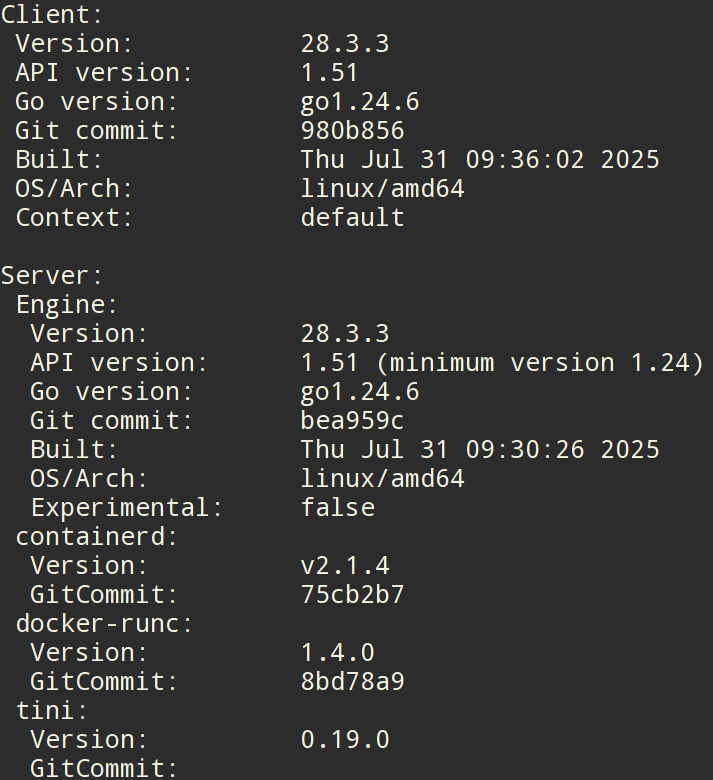

> Готовые образы берутся из сторонних источников: **Docker Hub** или другие

[Ссылка на Docker Hub](https://hub.docker.com/)

### Подготовка Docker (чтобы начать работать с "чистого листа")

1. Остановить все запущенные контейнеры
1. Удалить все остановленные контейнеры
1. Удалить все неиспользуемые образы

- Следует убедиться, нет ли у вас уже установленных и запущенных контейнеров:
```shell
docker ps -a
```
- Если есть, то лучше их остановить:
```shell
docker stop $(docker ps -q)
```
- Если остановленные контейнеры не нужно, то удалить их:
```shell
docker container prune
```
или
```shell
docker container prune $(docker ps -q)
```
- Ещё раз убедиться, что нет лишних контейнеров:
```shell
docker ps -a
```


- Опционально можно удалить ненужные образы. Показать текущие образы:
```shell
docker images
```
Удалить все ненужные образы
```shell
docker image prune -a
```
или
```shell
docker rmi $(docker images -q)
```

> Удалять нужно только учебные контейнеры и образы, т.к. есть риск потерять важные данные, которые могут содержаться в контейнерах!

### Получение готового образа Nginx

1. Поиск и получение готового образа на Docker Hub
1. Создание и запуск контейнера из полученного образа
1. Проверка состояния приложения из Docker-контейнера
1. Управление контейнером

Найти нужный образ на **Docker Hub**
```shell
docker search nginx
```

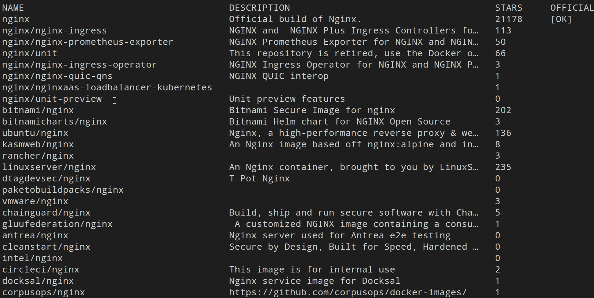

Получить, создать и запустить Nginx
```shell
docker run -d --name my-nginx -p 80:80 nginx
```

Если запуск контейнера не удался, то проверьте уже созданные контейнеры с таким именем у себя
```shell
docker ps -a
```


Показать загруженный на ваш компьютер образ
```shell
docker images
```

Если нужно только получить готовый образ, без создания и запуска контейнера, то
```shell
docker pull nginx
```

Получить информацию по загруженному образу:
```shell
docker inspect nginx
```

При необходимости остановить контейнер с таким именем:
```shell
docker stop my-nginx
```
Перезапустить контейнер по имени
```shell
docker restart my-nginx
```
Перезапустить контейнер по его **id**
```shell
docker restart 2e6c42d9b6af
```
Перед удалением нужно остановить указанный контейнер
```shell
docker stop my-nginx
```

Удалить выбранный контейнер по его имени
```shell
docker rm my-nginx
```


Если нужно создать ещё один контейнер из этого образа, то:
```shell
docker run -d --name nginx-my -p 81:80 nginx
```

> изменить имя и порт приложения!

[Открыть в браузере приложение из 2-го контейнера по адресу http://localhost:81/](http://localhost:81/)

И можно удалить ещё и образ загруженного ранее **Nginx**:

Получить id образа
```shell
docker images
```

Удалить по `id` нужный образ
```shell
docker rmi 062a783918fb
```

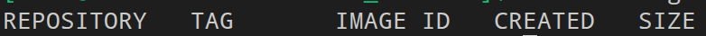

### Проверить работу контейнера

Можно снова установить и запустить Nginx (если его удаляли ранее)
```shell
docker run -d --name my-nginx -p 80:80 nginx
```

Показать наличие загруженного файла образа
```shell
docker images
```

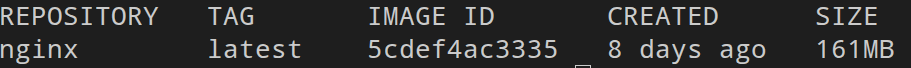

Показать только запущенные контейнеры
```shell
docker ps
```
или показать все контейнеры (в т.ч. остановленные)
```shell
docker ps -a
```
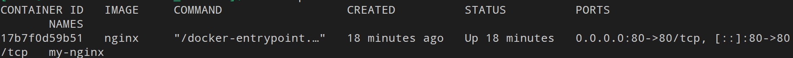

> Из одного образа можно получить несколько контейнеров!

Показать работающий Nginx

Способ 1
```shell
curl http://localhost/
```

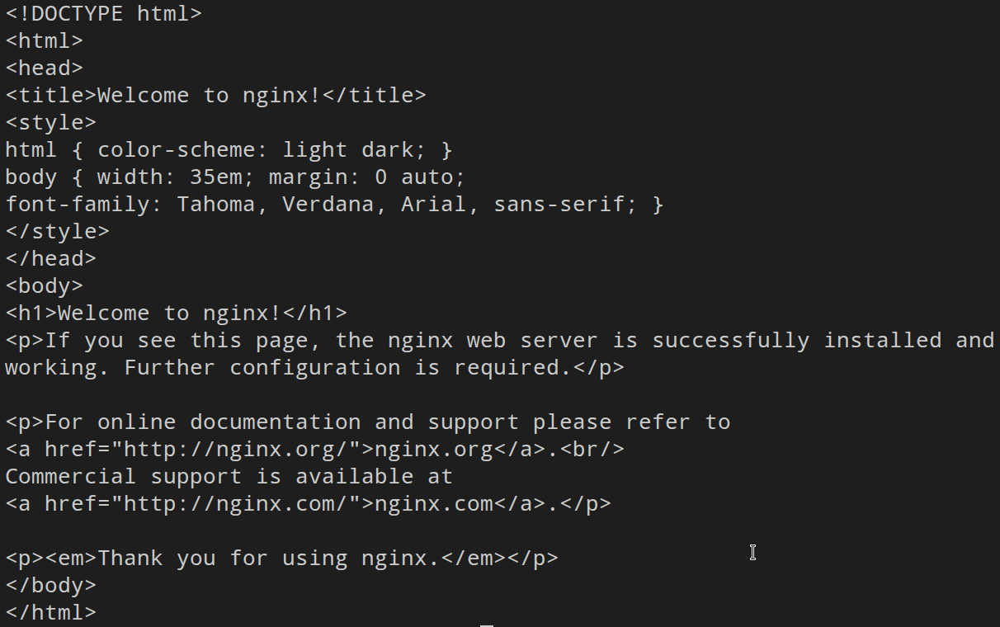

Способ 2 - [открыть http://localhost/ адрес в браузере](http://localhost/)

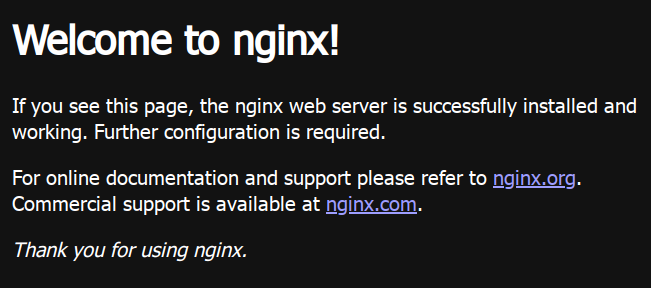

### Управление контейнером

#### Мониторинг контейнеров

Показать состояние всех контейнеров
```shell
docker ps -a
```

Показать подробности о контейнере
```shell
docker inspect my-nginx
```

Запустить мониторинг контейнеров
```shell
docker stats
```

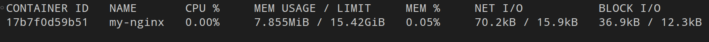


> Выйти из мониторинга контейнеров можно по `Ctrl+C`

Получить лог контейнера
```shell
docker logs my-nginx
```

Показать логи в режиме ожидания
```shell
docker logs -f my-nginx
```
> Выйти из логов в режиме ожидания можно по `Ctrl+C`

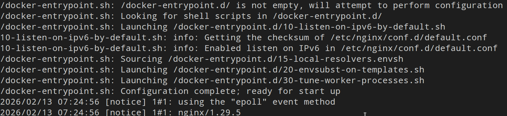

### Управление контейнером

Остановить контейнер
=======
## Веб-сервер Nginx

Скачать и запустить Nginx
```shell
docker run -d --name my-nginx -p 80:80 nginx:alpine
```

Проверить работоспособность контейнера командой:
```shell
curl http://localhost
```

[Или запустить в браузере: http://localhost](http://localhost)

Чтобы создать и запустить ещё один контейнер, надо указать другое имя и порт, например:
```shell
docker run -d --name nginx-copy -p 81:80 nginx:alpine
```

[Или запустить в браузере: http://localhost:81](http://localhost:81)

### Полезные команды для работы

#### Посмотреть запущенные контейнеры
```shell
docker ps
```

#### Остановить контейнер
>>>>>>> 1508656d9aa5607f68f246829f6818b69e9ca4ed
```shell
docker stop my-nginx
```

<<<<<<< HEAD
Снова запустить контейнер
=======
#### Запустить остановленный
>>>>>>> 1508656d9aa5607f68f246829f6818b69e9ca4ed
```shell
docker start my-nginx
```

<<<<<<< HEAD
Перезапустить контейнер
=======
#### Перезапустить контейнер
>>>>>>> 1508656d9aa5607f68f246829f6818b69e9ca4ed
```shell
docker restart my-nginx
```

<<<<<<< HEAD
Зайти в контейнер
```shell
docker exec -it my-nginx /bin/bash
```
или
```shell
docker exec -it my-nginx bash
```
или
```shell
docker exec -it my-nginx /bin/sh
```
или
```shell
docker exec -it my-nginx sh
```

внутри контейнера можно повыполнять некоторые команды Linux
Получить информацию об ОС контейнера
```shell
uname -a
```
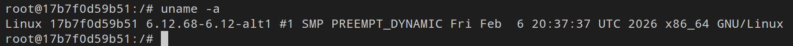

Получить больше информации об ОС контейнера
```shell
cat /etc/os-release
```
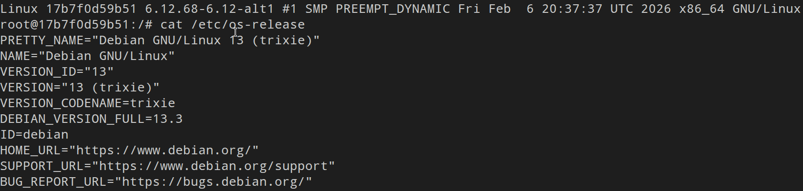

Установить **Fastfetch**
```shell
apt update && apt install -y fastfetch
```
> apt update - обновит списки источников приложений, apt install - установит указанное приложение
Запустить **Fastfetch**
```shell
fastfetch
```
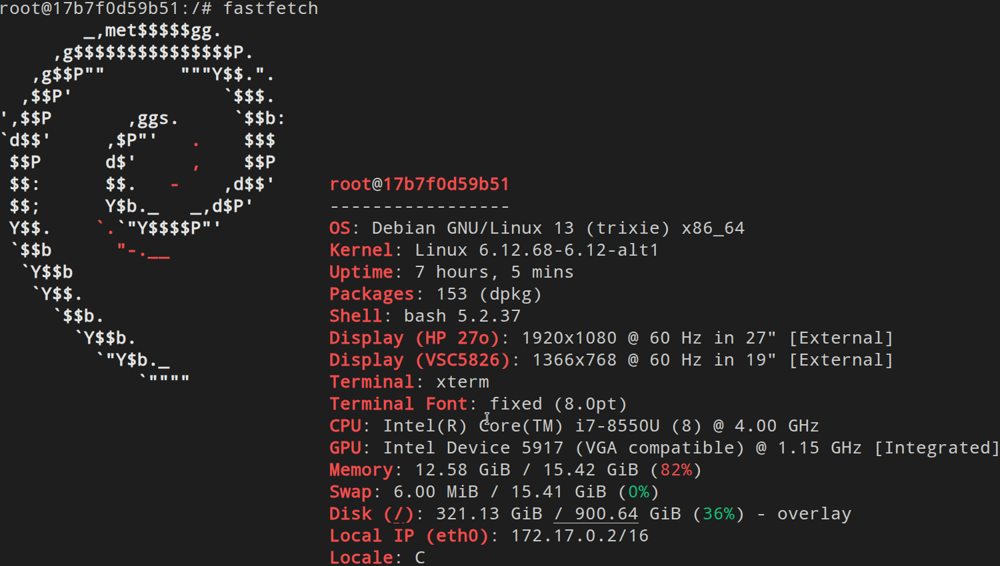

Можно установить ещё несколько приложений внутри Docker-контейнера:
```shell
apt update && apt install -y fastfetch htop cmatrix hollywood mc micro
```
> На все вопросы ответьте `1` и `Enter`

и позапускать их отдельно друг от друга:
```shell
htop
```


> Выйти из `htop` можно по **Q**

```shell
cmatrix
```


> Выйти из `cmatrix` можно по **Q**

```shell
hollywood
```


> Выйти из `hollywood` можно по `Ctrl-C`

Выйти из контейнера можно командой `exit`

Отредактировать текст страницы приветствия Nginx (Находится в разработке!)

Открыть файл `index.html` для редактирования содержимого
```shell
micro /usr/local/apache2/htdocs/index.html
```

отредайтируйте и сохраните по `Ctrl+S` и выйти из режима редактирования по `Ctrl+Q`

[Проверить изменения на открытой странице >>](http://localhost/)


Остановить все запущенные контейнеры
```shell
docker stop $(docker ps -q)
```

Удалить все остановленные контейнеры
```shell
docker container prune $(docker ps -q)
```

Удалить все образы
```shell
docker rmi $(docker images -q)
=======
#### Посмотреть логи
```shell
docker logs my-nginx
```
```shell
docker logs -f my-nginx  # в реальном времени
```

> Чтобы выйти из режима просмотра логов, нужно выполнить `Ctrl+C`

#### Войти в контейнер
```shell
docker exec -it my-nginx /bin/sh
```

#### Получить ин-фу по ОС контейнера
```shell
cat /etc/os-release
```

```shell
top
```

> Чтобы выйти из top, нужно выполнить `Q`

> т.е. это скорей всео какой-то Linux, то можно попробовать повыполнять разные команды из Linux

Установить fastfetch (например)
```shell
apt install fastfetch
```
после установки выполнить команду:
```shell
fastfetch
```

> Таким образом вы получаете в контейнере маленькую копию Linux, с которым можно работать.

Чтобы выйти из контейнера, следует выполнить:
```shell
exit
```

#### Скопировать файл из контейнера
```shell
docker cp my-nginx:/etc/nginx/nginx.conf ./nginx.conf
```

#### Мониторинг контейнеров
```shell
docker stats
```

> Вывод ин-фы мониторинга обновляется каждые 2 сек.!

Выйти из мониторинга по `Ctrl+C`

#### Мониторинг без постоянного обновления (однократный вывод)
```shell
docker stats --no-stream
```
```shell
docker stats $(docker ps -q)
```

#### Удалить контейнер
```shell
docker rm my-nginx
```

#### Удалить контейнер и его volume (если есть)
```shell
docker rm -v my-nginx
>>>>>>> 1508656d9aa5607f68f246829f6818b69e9ca4ed
```